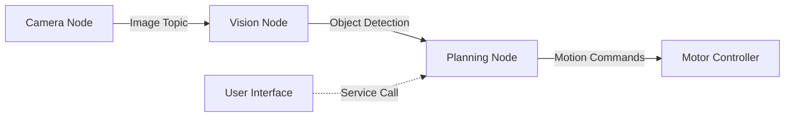

# The Robotic Nervous System (ROS 2)

## Introduction

ROS 2 (Robot Operating System 2) represents a fundamental shift in how we architect robot software systems. Built from the ground up to address the limitations of ROS 1, ROS 2 provides a robust, real-time capable framework for developing complex robotic applications. This module introduces you to the core concepts and practical implementation of ROS 2 for humanoid robotics.

## What You'll Learn

In this module, you'll master the building blocks of ROS 2 architecture. Starting with nodes and topics, you'll learn how robots communicate internally through a publish-subscribe messaging system. You'll then progress to services and actions for synchronous and long-running operations, essential for coordinating complex robotic behaviors.

We'll dive deep into creating URDF (Unified Robot Description Format) models that describe the physical structure of humanoid robots. You'll learn how to connect Python-based AI agents to ROS 2 controllers using the rclpy client library, enabling sophisticated decision-making in your robotic systems.

## Prerequisites

- Basic Python programming (functions, classes, async/await)
- Familiarity with Linux command line
- Understanding of robotics coordinate frames (helpful but not required)

## Learning Outcomes

By the end of this module, you will be able to:

- Design and implement ROS 2 node architectures for multi-agent systems
- Create custom message types and services for robot communication
- Build and visualize URDF models for humanoid robots
- Integrate Python AI agents with ROS 2 control pipelines
- Debug ROS 2 applications using command-line tools and visualization

## Module Structure

This module contains 6-8 sections covering topics from basic pub-sub patterns to advanced integration with AI frameworks. Each section includes tested code examples, diagrams, and citations to official ROS 2 documentation.

---

## 1. Understanding ROS 2 Architecture

### The Node-Based Architecture

ROS 2 is built on a distributed node architecture. Each node is an independent process that performs a specific computation. Nodes communicate through:

- **Topics** (publish-subscribe, asynchronous)
- **Services** (request-response, synchronous)
- **Actions** (long-running tasks with feedback)
- **Parameters** (configuration values)



### Why ROS 2?

ROS 2 addresses critical limitations of ROS 1:

1. **Real-time Capable**: Built on DDS (Data Distribution Service) for deterministic communication
2. **Multi-robot Systems**: Native support for distributed systems across networks
3. **Security**: Authentication and encryption built-in
4. **Cross-platform**: Works on Linux, Windows, macOS
5. **Production Ready**: Used in commercial robots and autonomous vehicles

---

## 2. Your First ROS 2 Node

### Installation Check

Before we begin, verify your ROS 2 installation:

```bash
# Check ROS 2 version
ros2 --version

# List available commands
ros2 --help

# Check if workspace is sourced
echo $ROS_DISTRO
```

Expected output: `humble` (or your installed distribution)

### Creating a Simple Publisher Node

Let's create a node that publishes sensor data. This simulates a temperature sensor:

```python title="temperature_publisher.py"
import rclpy
from rclpy.node import Node
from std_msgs.msg import Float32

class TemperatureSensor(Node):
    def __init__(self):
        super().__init__('temperature_sensor')

        # Create publisher
        self.publisher = self.create_publisher(
            Float32,
            'temperature',
            10  # Queue size
        )

        # Create timer (publish every 0.5 seconds)
        self.timer = self.create_timer(0.5, self.publish_temperature)

        self.temperature = 20.0
        self.get_logger().info('Temperature sensor started')

    def publish_temperature(self):
        msg = Float32()
        # Simulate fluctuating temperature
        import random
        self.temperature += random.uniform(-0.5, 0.5)
        msg.data = self.temperature

        self.publisher.publish(msg)
        self.get_logger().info(f'Publishing: {msg.data:.2f}°C')

def main(args=None):
    rclpy.init(args=args)
    node = TemperatureSensor()

    try:
        rclpy.spin(node)
    except KeyboardInterrupt:
        pass

    node.destroy_node()
    rclpy.shutdown()

if __name__ == '__main__':
    main()
```

### Creating a Subscriber Node

Now create a node that listens to the temperature data:

```python title="temperature_monitor.py"
import rclpy
from rclpy.node import Node
from std_msgs.msg import Float32

class TemperatureMonitor(Node):
    def __init__(self):
        super().__init__('temperature_monitor')

        # Create subscriber
        self.subscription = self.create_subscription(
            Float32,
            'temperature',
            self.temperature_callback,
            10
        )

        self.get_logger().info('Temperature monitor started')

    def temperature_callback(self, msg):
        temp = msg.data

        # Alert if temperature is too high
        if temp > 25.0:
            self.get_logger().warn(f'High temperature: {temp:.2f}°C')
        elif temp < 15.0:
            self.get_logger().warn(f'Low temperature: {temp:.2f}°C')
        else:
            self.get_logger().info(f'Temperature OK: {temp:.2f}°C')

def main(args=None):
    rclpy.init(args=args)
    node = TemperatureMonitor()

    try:
        rclpy.spin(node)
    except KeyboardInterrupt:
        pass

    node.destroy_node()
    rclpy.shutdown()

if __name__ == '__main__':
    main()
```

### Running Your Nodes

Open two terminal windows:

**Terminal 1:**
```bash
python3 temperature_publisher.py
```

**Terminal 2:**
```bash
python3 temperature_monitor.py
```

You should see the publisher sending temperature data and the monitor receiving and evaluating it.

---

## 3. Custom Messages and Packages

### Creating a ROS 2 Package

Standard messages like `Float32` are limiting. Let's create custom messages:

```bash
# Create a workspace
mkdir -p ~/ros2_ws/src
cd ~/ros2_ws/src

# Create a package
ros2 pkg create --build-type ament_python humanoid_interfaces

# Navigate to package
cd humanoid_interfaces
```

### Defining Custom Messages

Create a `msg` directory and define a custom message:

```bash
mkdir msg
```

Create `msg/JointState.msg`:

```
# Custom message for humanoid joint states
string joint_name
float64 position      # radians
float64 velocity      # rad/s
float64 effort        # Nm (torque)
float64 temperature   # Celsius
bool is_moving
```

Create `msg/HumanoidPose.msg`:

```
# Full humanoid pose
Header header
JointState[] joints
geometry_msgs/Pose base_pose
```

### Updating package.xml

Add dependencies to `package.xml`:

```xml
<buildtool_depend>ament_cmake</buildtool_depend>
<build_depend>rosidl_default_generators</build_depend>
<exec_depend>rosidl_default_runtime</exec_depend>
<member_of_group>rosidl_interface_packages</member_of_group>

<depend>geometry_msgs</depend>
<depend>std_msgs</depend>
```

### Updating CMakeLists.txt

Add message generation:

```cmake
find_package(rosidl_default_generators REQUIRED)
find_package(geometry_msgs REQUIRED)
find_package(std_msgs REQUIRED)

rosidl_generate_interfaces(${PROJECT_NAME}
  "msg/JointState.msg"
  "msg/HumanoidPose.msg"
  DEPENDENCIES geometry_msgs std_msgs
)
```

### Building the Package

```bash
cd ~/ros2_ws
colcon build --packages-select humanoid_interfaces
source install/setup.bash
```

### Using Custom Messages

```python title="joint_publisher.py"
import rclpy
from rclpy.node import Node
from humanoid_interfaces.msg import JointState
import math

class JointController(Node):
    def __init__(self):
        super().__init__('joint_controller')

        self.publisher = self.create_publisher(
            JointState,
            'joint_states',
            10
        )

        self.timer = self.create_timer(0.1, self.publish_joint_state)
        self.angle = 0.0

    def publish_joint_state(self):
        msg = JointState()
        msg.joint_name = 'right_shoulder'
        msg.position = math.sin(self.angle)
        msg.velocity = math.cos(self.angle)
        msg.effort = 0.5
        msg.temperature = 22.0
        msg.is_moving = True

        self.publisher.publish(msg)
        self.angle += 0.1

        self.get_logger().info(
            f'Joint: {msg.joint_name}, Pos: {msg.position:.2f}'
        )

def main():
    rclpy.init()
    node = JointController()
    rclpy.spin(node)
    rclpy.shutdown()

if __name__ == '__main__':
    main()
```

---

## 4. Services for Request-Response Communication

Services enable synchronous communication. Let's create a service for robot calibration:

### Defining a Service

Create `srv/CalibrateJoint.srv`:

```
# Request
string joint_name
float64 target_position
---
# Response
bool success
string message
float64 final_position
```

### Service Server

```python title="calibration_server.py"
import rclpy
from rclpy.node import Node
from humanoid_interfaces.srv import CalibrateJoint
import time

class CalibrationServer(Node):
    def __init__(self):
        super().__init__('calibration_server')

        self.srv = self.create_service(
            CalibrateJoint,
            'calibrate_joint',
            self.calibrate_callback
        )

        self.get_logger().info('Calibration service ready')

    def calibrate_callback(self, request, response):
        self.get_logger().info(
            f'Calibrating {request.joint_name} to {request.target_position}'
        )

        # Simulate calibration process
        time.sleep(2)

        # Simulate success/failure
        if -3.14 <= request.target_position <= 3.14:
            response.success = True
            response.message = 'Calibration successful'
            response.final_position = request.target_position
        else:
            response.success = False
            response.message = 'Target position out of range'
            response.final_position = 0.0

        return response

def main():
    rclpy.init()
    node = CalibrationServer()
    rclpy.spin(node)
    rclpy.shutdown()

if __name__ == '__main__':
    main()
```

### Service Client

```python title="calibration_client.py"
import rclpy
from rclpy.node import Node
from humanoid_interfaces.srv import CalibrateJoint

class CalibrationClient(Node):
    def __init__(self):
        super().__init__('calibration_client')

        self.client = self.create_client(
            CalibrateJoint,
            'calibrate_joint'
        )

        # Wait for service to be available
        while not self.client.wait_for_service(timeout_sec=1.0):
            self.get_logger().info('Waiting for calibration service...')

    def send_request(self, joint_name, target_pos):
        request = CalibrateJoint.Request()
        request.joint_name = joint_name
        request.target_position = target_pos

        self.future = self.client.call_async(request)
        rclpy.spin_until_future_complete(self, self.future)

        return self.future.result()

def main():
    rclpy.init()
    client = CalibrationClient()

    # Test calibration
    response = client.send_request('left_elbow', 1.57)

    if response.success:
        client.get_logger().info(
            f'Success! Final position: {response.final_position}'
        )
    else:
        client.get_logger().error(f'Failed: {response.message}')

    client.destroy_node()
    rclpy.shutdown()

if __name__ == '__main__':
    main()
```

---

## 5. Actions for Long-Running Tasks

Actions are ideal for tasks that take time and need feedback (like moving a robot arm).

### Defining an Action

Create `action/MoveJoint.action`:

```
# Goal
string joint_name
float64 target_position
float64 max_velocity
---
# Result
bool success
float64 final_position
float64 time_elapsed
---
# Feedback
float64 current_position
float64 progress_percentage
```

### Action Server

```python title="move_joint_server.py"
import rclpy
from rclpy.action import ActionServer
from rclpy.node import Node
from humanoid_interfaces.action import MoveJoint
import time

class MoveJointServer(Node):
    def __init__(self):
        super().__init__('move_joint_server')

        self._action_server = ActionServer(
            self,
            MoveJoint,
            'move_joint',
            self.execute_callback
        )

        self.get_logger().info('Move joint action server started')

    def execute_callback(self, goal_handle):
        self.get_logger().info('Executing goal...')

        feedback_msg = MoveJoint.Feedback()

        start_pos = 0.0
        target = goal_handle.request.target_position

        # Simulate movement with feedback
        for i in range(10):
            # Check if goal was canceled
            if goal_handle.is_cancel_requested:
                goal_handle.canceled()
                return MoveJoint.Result()

            # Update feedback
            feedback_msg.current_position = start_pos + (target - start_pos) * (i / 10)
            feedback_msg.progress_percentage = (i + 1) * 10.0

            goal_handle.publish_feedback(feedback_msg)
            time.sleep(0.5)

        goal_handle.succeed()

        result = MoveJoint.Result()
        result.success = True
        result.final_position = target
        result.time_elapsed = 5.0

        return result

def main():
    rclpy.init()
    node = MoveJointServer()
    rclpy.spin(node)
    rclpy.shutdown()

if __name__ == '__main__':
    main()
```

### Action Client

```python title="move_joint_client.py"
import rclpy
from rclpy.action import ActionClient
from rclpy.node import Node
from humanoid_interfaces.action import MoveJoint

class MoveJointClient(Node):
    def __init__(self):
        super().__init__('move_joint_client')

        self._action_client = ActionClient(
            self,
            MoveJoint,
            'move_joint'
        )

    def send_goal(self, joint_name, target_pos):
        goal_msg = MoveJoint.Goal()
        goal_msg.joint_name = joint_name
        goal_msg.target_position = target_pos
        goal_msg.max_velocity = 1.0

        self._action_client.wait_for_server()

        self._send_goal_future = self._action_client.send_goal_async(
            goal_msg,
            feedback_callback=self.feedback_callback
        )

        self._send_goal_future.add_done_callback(self.goal_response_callback)

    def goal_response_callback(self, future):
        goal_handle = future.result()

        if not goal_handle.accepted:
            self.get_logger().info('Goal rejected')
            return

        self.get_logger().info('Goal accepted')

        self._get_result_future = goal_handle.get_result_async()
        self._get_result_future.add_done_callback(self.get_result_callback)

    def get_result_callback(self, future):
        result = future.result().result
        self.get_logger().info(
            f'Result: Success={result.success}, '
            f'Final={result.final_position:.2f}, '
            f'Time={result.time_elapsed:.2f}s'
        )
        rclpy.shutdown()

    def feedback_callback(self, feedback_msg):
        feedback = feedback_msg.feedback
        self.get_logger().info(
            f'Progress: {feedback.progress_percentage:.0f}%, '
            f'Position: {feedback.current_position:.2f}'
        )

def main():
    rclpy.init()
    client = MoveJointClient()
    client.send_goal('right_shoulder', 1.57)
    rclpy.spin(client)

if __name__ == '__main__':
    main()
```

---

## 6. URDF: Describing Your Robot

URDF (Unified Robot Description Format) describes the physical structure of robots.

### Basic URDF Structure

```xml title="simple_humanoid.urdf"
<?xml version="1.0"?>
<robot name="simple_humanoid">

  <!-- Base Link -->
  <link name="base_link">
    <visual>
      <geometry>
        <box size="0.3 0.3 0.5"/>
      </geometry>
      <material name="blue">
        <color rgba="0 0 0.8 1"/>
      </material>
    </visual>
    <collision>
      <geometry>
        <box size="0.3 0.3 0.5"/>
      </geometry>
    </collision>
    <inertial>
      <mass value="10.0"/>
      <inertia ixx="0.4" ixy="0.0" ixz="0.0"
               iyy="0.4" iyz="0.0" izz="0.2"/>
    </inertial>
  </link>

  <!-- Right Shoulder -->
  <link name="right_shoulder">
    <visual>
      <geometry>
        <cylinder radius="0.05" length="0.3"/>
      </geometry>
      <material name="red">
        <color rgba="0.8 0 0 1"/>
      </material>
    </visual>
    <collision>
      <geometry>
        <cylinder radius="0.05" length="0.3"/>
      </geometry>
    </collision>
    <inertial>
      <mass value="1.0"/>
      <inertia ixx="0.01" ixy="0.0" ixz="0.0"
               iyy="0.01" iyz="0.0" izz="0.001"/>
    </inertial>
  </link>

  <!-- Joint connecting base to shoulder -->
  <joint name="right_shoulder_joint" type="revolute">
    <parent link="base_link"/>
    <child link="right_shoulder"/>
    <origin xyz="0.15 0 0.2" rpy="0 0 0"/>
    <axis xyz="0 1 0"/>
    <limit lower="-1.57" upper="1.57" effort="10" velocity="1.0"/>
  </joint>

</robot>
```

### Visualizing URDF in RViz

```bash
# Install RViz2
sudo apt install ros-humble-rviz2

# View URDF
ros2 run joint_state_publisher_gui joint_state_publisher_gui simple_humanoid.urdf &
rviz2
```

---

## 7. Integrating AI Agents with ROS 2

### AI Agent Node Example

Let's create an AI decision-making node:

```python title="ai_decision_node.py"
import rclpy
from rclpy.node import Node
from humanoid_interfaces.msg import JointState, HumanoidPose
from sensor_msgs.msg import Image
import numpy as np

class AIDecisionMaker(Node):
    def __init__(self):
        super().__init__('ai_decision_maker')

        # Subscribers
        self.joint_sub = self.create_subscription(
            JointState,
            'joint_states',
            self.joint_callback,
            10
        )

        self.vision_sub = self.create_subscription(
            Image,
            'camera/image',
            self.vision_callback,
            10
        )

        # Publishers
        self.command_pub = self.create_publisher(
            JointState,
            'joint_commands',
            10
        )

        # State
        self.current_joints = {}
        self.latest_image = None

        # AI model (placeholder)
        self.model = None  # Load your AI model here

        self.get_logger().info('AI Decision Maker started')

    def joint_callback(self, msg):
        """Store current joint state"""
        self.current_joints[msg.joint_name] = {
            'position': msg.position,
            'velocity': msg.velocity
        }

    def vision_callback(self, msg):
        """Process vision input"""
        # Convert ROS Image to numpy array
        # self.latest_image = self.bridge.imgmsg_to_cv2(msg, "bgr8")

        # Make AI decision
        self.make_decision()

    def make_decision(self):
        """AI decision logic"""
        if len(self.current_joints) == 0:
            return

        # Example: Simple reactive behavior
        # In practice, use ML models (PyTorch, TensorFlow)

        command = JointState()
        command.joint_name = 'right_shoulder'

        # Simple logic: oscillate joint
        current_pos = self.current_joints.get('right_shoulder', {}).get('position', 0.0)
        command.position = -current_pos * 0.9
        command.velocity = 1.0
        command.effort = 2.0
        command.temperature = 22.0
        command.is_moving = True

        self.command_pub.publish(command)

        self.get_logger().info(f'AI Command: pos={command.position:.2f}')

def main():
    rclpy.init()
    node = AIDecisionMaker()
    rclpy.spin(node)
    rclpy.shutdown()

if __name__ == '__main__':
    main()
```

---

## 8. Debugging and Introspection

### Essential ROS 2 CLI Tools

```bash
# List all active nodes
ros2 node list

# Get info about a node
ros2 node info /temperature_sensor

# List all topics
ros2 topic list

# See messages on a topic
ros2 topic echo /temperature

# Get topic info
ros2 topic info /temperature

# Publish to a topic from command line
ros2 topic pub /temperature std_msgs/msg/Float32 "{data: 25.0}"

# List all services
ros2 service list

# Call a service
ros2 service call /calibrate_joint humanoid_interfaces/srv/CalibrateJoint "{joint_name: 'left_elbow', target_position: 1.57}"

# View computation graph
rqt_graph
```

### Using RQt for Debugging

```bash
# Launch RQt
rqt

# Useful plugins:
# - Topic Monitor
# - Service Caller
# - Message Publisher
# - Node Graph
# - Plot (for real-time data visualization)
```

---

## 9. Best Practices

### Node Design Principles

1. **Single Responsibility**: Each node should do one thing well
2. **Loose Coupling**: Nodes communicate only through ROS interfaces
3. **Fail Gracefully**: Handle errors and timeouts
4. **Configurable**: Use parameters for configuration

### Performance Optimization

```python
class OptimizedPublisher(Node):
    def __init__(self):
        super().__init__('optimized_publisher')

        # Use QoS profiles for reliability
        from rclpy.qos import QoSProfile, ReliabilityPolicy

        qos = QoSProfile(
            depth=10,
            reliability=ReliabilityPolicy.BEST_EFFORT  # Or RELIABLE
        )

        self.publisher = self.create_publisher(
            JointState,
            'joint_states',
            qos
        )
```

### Error Handling

```python
def safe_callback(self, msg):
    try:
        # Process message
        result = self.process(msg)

        if result is None:
            self.get_logger().warn('Processing returned None')
            return

        self.publish_result(result)

    except Exception as e:
        self.get_logger().error(f'Error in callback: {str(e)}')
```

---

## 10. Practical Exercise: Build a Humanoid Balance Controller

### Exercise Goal

Create a system that:
1. Reads IMU (Inertial Measurement Unit) data
2. Calculates balance correction
3. Commands ankle joints to maintain balance

### Step 1: IMU Publisher (Simulated)

```python title="imu_simulator.py"
import rclpy
from rclpy.node import Node
from sensor_msgs.msg import Imu
import math
import random

class IMUSimulator(Node):
    def __init__(self):
        super().__init__('imu_simulator')

        self.publisher = self.create_publisher(Imu, 'imu/data', 10)
        self.timer = self.create_timer(0.01, self.publish_imu)  # 100Hz

        self.angle = 0.0

    def publish_imu(self):
        msg = Imu()
        msg.header.stamp = self.get_clock().now().to_msg()
        msg.header.frame_id = 'imu_link'

        # Simulate swaying motion
        self.angle += 0.01
        tilt = 0.1 * math.sin(self.angle) + random.gauss(0, 0.01)

        # Orientation (simplified)
        msg.orientation.x = tilt
        msg.orientation.y = 0.0
        msg.orientation.z = 0.0
        msg.orientation.w = math.sqrt(1 - tilt**2)

        # Angular velocity
        msg.angular_velocity.x = 0.1 * math.cos(self.angle)
        msg.angular_velocity.y = 0.0
        msg.angular_velocity.z = 0.0

        self.publisher.publish(msg)

def main():
    rclpy.init()
    node = IMUSimulator()
    rclpy.spin(node)
    rclpy.shutdown()

if __name__ == '__main__':
    main()
```

### Step 2: Balance Controller

```python title="balance_controller.py"
import rclpy
from rclpy.node import Node
from sensor_msgs.msg import Imu
from humanoid_interfaces.msg import JointState

class BalanceController(Node):
    def __init__(self):
        super().__init__('balance_controller')

        # PID gains
        self.kp = 2.0  # Proportional gain
        self.ki = 0.1  # Integral gain
        self.kd = 0.5  # Derivative gain

        self.integral_error = 0.0
        self.last_error = 0.0

        # Subscribe to IMU
        self.imu_sub = self.create_subscription(
            Imu,
            'imu/data',
            self.imu_callback,
            10
        )

        # Publish joint commands
        self.joint_pub = self.create_publisher(
            JointState,
            'ankle_commands',
            10
        )

        self.get_logger().info('Balance controller started')

    def imu_callback(self, msg):
        # Extract tilt angle from orientation
        tilt = msg.orientation.x  # Simplified

        # PID control
        error = -tilt  # Target is 0 tilt
        self.integral_error += error * 0.01
        derivative = (error - self.last_error) / 0.01

        # Calculate correction
        correction = (
            self.kp * error +
            self.ki * self.integral_error +
            self.kd * derivative
        )

        # Limit correction
        correction = max(min(correction, 0.5), -0.5)

        # Publish ankle command
        cmd = JointState()
        cmd.joint_name = 'ankle_pitch'
        cmd.position = correction
        cmd.velocity = derivative
        cmd.effort = correction * 10.0
        cmd.is_moving = abs(correction) > 0.01

        self.joint_pub.publish(cmd)

        self.get_logger().info(
            f'Tilt: {tilt:.3f}, Correction: {correction:.3f}',
            throttle_duration_sec=1.0
        )

        self.last_error = error

def main():
    rclpy.init()
    node = BalanceController()
    rclpy.spin(node)
    rclpy.shutdown()

if __name__ == '__main__':
    main()
```

### Step 3: Run the System

```bash
# Terminal 1: IMU simulator
python3 imu_simulator.py

# Terminal 2: Balance controller
python3 balance_controller.py

# Terminal 3: Monitor ankle commands
ros2 topic echo /ankle_commands
```

---

## Summary

You've learned the fundamentals of ROS 2:

✅ **Node architecture** and distributed communication
✅ **Topics** for asynchronous pub-sub messaging
✅ **Services** for synchronous request-response
✅ **Actions** for long-running tasks with feedback
✅ **Custom messages** and package creation
✅ **URDF** for robot description
✅ **AI integration** patterns
✅ **Debugging tools** and best practices

### Next Steps

1. Explore **tf2** for coordinate frame transformations
2. Learn **Navigation2** for autonomous navigation
3. Integrate **computer vision** with ROS 2
4. Study **MoveIt2** for motion planning
5. Deploy on **real hardware** (Raspberry Pi, NVIDIA Jetson)

### Additional Resources

- [ROS 2 Documentation](https://docs.ros.org/en/humble/)
- [ROS 2 Design Patterns](https://design.ros2.org/)
- [ROS 2 Tutorials](https://docs.ros.org/en/humble/Tutorials.html)
- [ROS Discourse Community](https://discourse.ros.org/)

---

## Knowledge Check

Before moving to the next module, ensure you can:

- [ ] Create a ROS 2 package from scratch
- [ ] Write publisher and subscriber nodes
- [ ] Define and use custom messages
- [ ] Implement service servers and clients
- [ ] Create action servers with feedback
- [ ] Design basic URDF models
- [ ] Debug ROS 2 systems using CLI tools
- [ ] Apply PID control in ROS 2 nodes

**Ready to continue? Move on to Module 2: Computer Vision for Robotics!**
