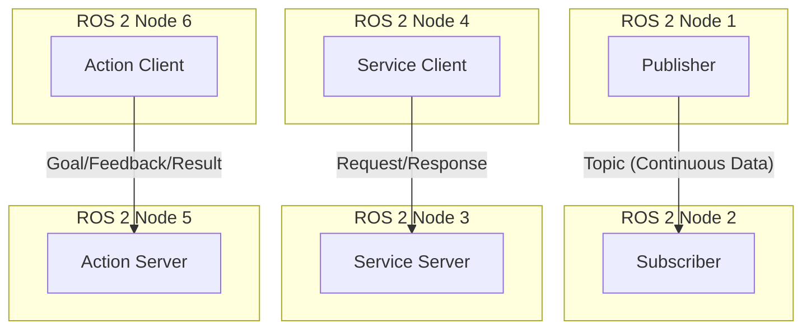

# ROS 2 Communication Patterns

As we've seen in the previous lessons, ROS 2 provides several ways for nodes to communicate with each other. This diagram summarizes the main communication patterns:

-   **Topics** are for continuous streams of data. A publisher sends messages to a topic, and any number of subscribers can receive them. This is a one-to-many communication pattern.
-   **Services** are for request/response interactions. A client sends a request to a server, and the server sends back a response. This is a one-to-one communication pattern.
-   **Actions** are for long-running tasks. A client sends a goal to a server, and the server can provide feedback on its progress and a final result. This is also a one-to-one communication pattern, but it is asynchronous and provides more feedback than services.
